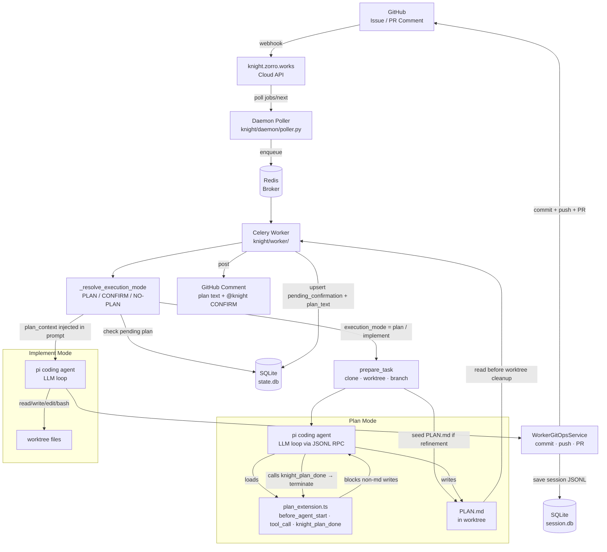
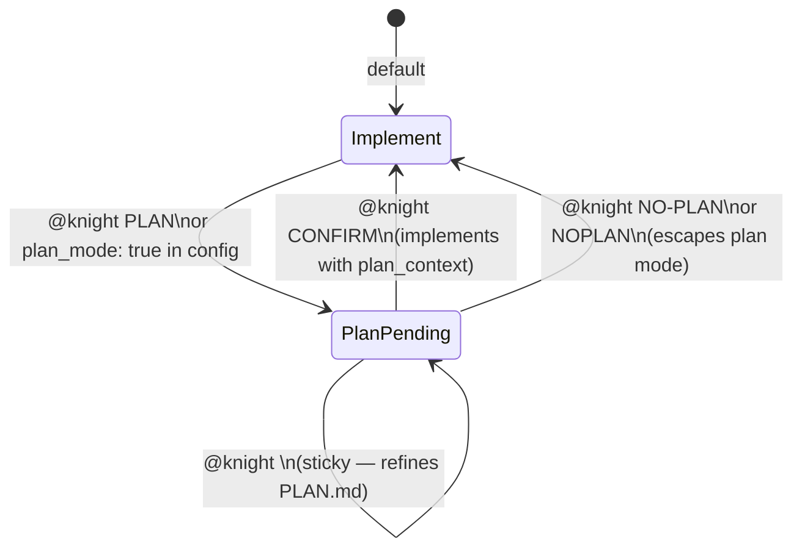
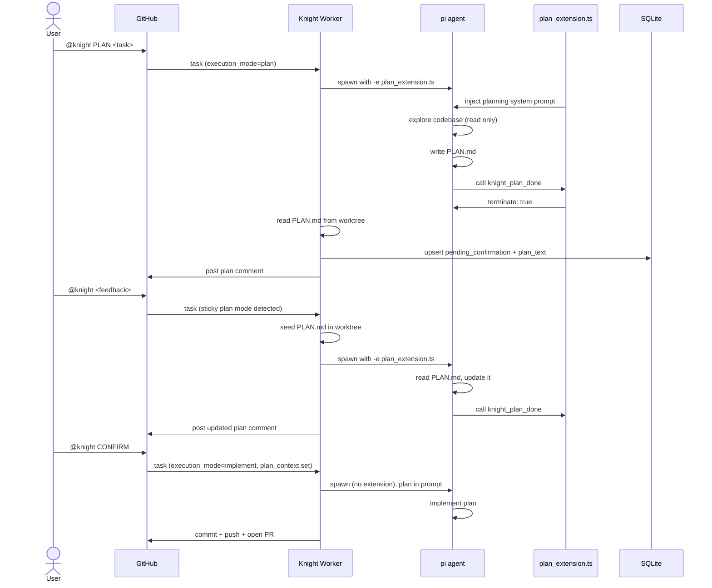

# Knight — Architecture

## Full System Flow

```mermaid
flowchart TD
    GH[GitHub\nIssue / PR Comment]
    Cloud[knight.zorro.works\nCloud API]
    Daemon[Daemon Poller\nknight/daemon/poller.py]
    Redis[(Redis\nBroker)]
    Worker[Celery Worker\nknight/worker/]
    Resolve[_resolve_execution_mode\nPLAN / CONFIRM / NO-PLAN]
    StateDB[(SQLite\nstate.db)]
    SessionDB[(SQLite\nsession.db)]
    Prepare[prepare_task\nclone · worktree · branch]
    Pi[pi coding agent\nLLM loop via JSONL RPC]
    Ext[plan_extension.ts\nbefore_agent_start · tool_call · knight_plan_done]
    PLANMD[PLAN.md\nin worktree]
    GitOps[WorkerGitOpsService\ncommit · push · PR]
    PlanComment[GitHub Comment\nplan text + @knight CONFIRM]

    GH -->|webhook| Cloud
    Cloud -->|poll jobs/next| Daemon
    Daemon -->|enqueue| Redis
    Redis --> Worker
    Worker --> Resolve
    Resolve -->|check pending plan| StateDB
    Resolve -->|execution_mode = plan / implement| Prepare
    Prepare -->|seed PLAN.md if refinement| PLANMD
    Prepare --> Pi

    subgraph Plan Mode
        Pi -->|loads| Ext
        Ext -->|blocks non-md writes| Pi
        Pi -->|writes| PLANMD
        Pi -->|calls knight_plan_done → terminate| Ext
    end

    PLANMD -->|read before worktree cleanup| Worker
    Worker -->|upsert pending_confirmation + plan_text| StateDB
    Worker -->|post| PlanComment

    subgraph Implement Mode
        Pi2[pi coding agent\nLLM loop]
        Pi2 -->|read/write/edit/bash| Code[worktree files]
    end

    Resolve -->|plan_context injected in prompt| Pi2
    Pi2 --> GitOps
    GitOps -->|commit + push + PR| GH
    GitOps -->|save session JSONL| SessionDB
```

## Plan Mode State Machine

```mermaid
stateDiagram-v2
    [*] --> Implement: default

    Implement --> PlanPending: @knight PLAN\nor plan_mode: true in config

    PlanPending --> PlanPending: @knight <feedback>\n(sticky — refines PLAN.md)

    PlanPending --> Implement: @knight CONFIRM\n(implements with plan_context)

    PlanPending --> Implement: @knight NO-PLAN\nor NOPLAN\n(escapes plan mode)
```

## Plan Mode Task Flow

```mermaid
sequenceDiagram
    actor User
    participant GH as GitHub
    participant Worker as Knight Worker
    participant Pi as pi agent
    participant Ext as plan_extension.ts
    participant DB as SQLite

    User->>GH: @knight PLAN <task>
    GH->>Worker: task (execution_mode=plan)
    Worker->>Pi: spawn with -e plan_extension.ts
    Ext->>Pi: inject planning system prompt
    Pi->>Pi: explore codebase (read only)
    Pi->>Pi: write PLAN.md
    Pi->>Ext: call knight_plan_done
    Ext->>Pi: terminate: true
    Worker->>Worker: read PLAN.md from worktree
    Worker->>DB: upsert pending_confirmation + plan_text
    Worker->>GH: post plan comment

    User->>GH: @knight <feedback>
    GH->>Worker: task (sticky plan mode detected)
    Worker->>Worker: seed PLAN.md in worktree
    Worker->>Pi: spawn with -e plan_extension.ts
    Pi->>Pi: read PLAN.md, update it
    Pi->>Ext: call knight_plan_done
    Worker->>GH: post updated plan comment

    User->>GH: @knight CONFIRM
    GH->>Worker: task (execution_mode=implement, plan_context set)
    Worker->>Pi: spawn (no extension), plan in prompt
    Pi->>Pi: implement plan
    Worker->>GH: commit + push + open PR
```
